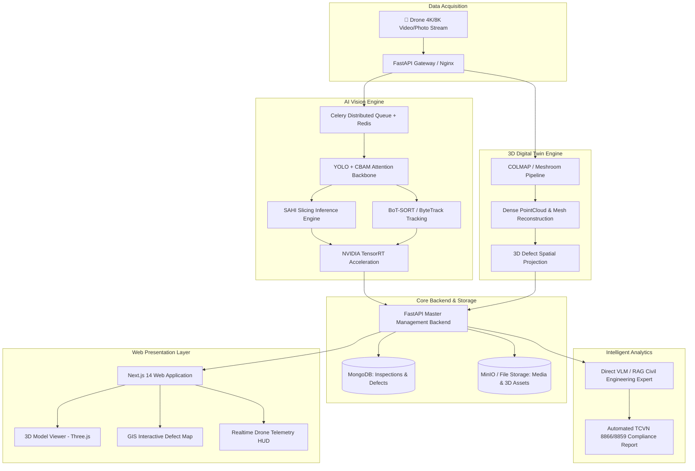

<div align="center">

# 🛸 AI Drone Inspection & 3D Digital Twin Platform
### Next-Gen Civil Infrastructure Quality & Defect Assessment System
**SOTA Computer Vision (YOLO + CBAM + SAHI) • 3D Digital Twin Reconstruction • Next.js 14 • FastAPI**

[](https://python.org)
[](https://pytorch.org)
[](https://developer.nvidia.com/tensorrt)
[](https://fastapi.tiangolo.com)
[](https://nextjs.org)
[](https://tailwindcss.com)
[](https://docker.com)
[](LICENSE)

---

</div>

## 📌 Executive Summary (Tổng Quan Dự Án)

**AI Drone Inspection & 3D Digital Twin Platform** là hệ thống công nghệ cao ứng dụng **Trí tuệ nhân tạo (AI Vision)** kết hợp **Tái tạo không gian số 3D (Digital Twin)** nhằm tự động hóa quy trình khảo sát, phát hiện khuyết tật và thẩm định chất lượng các công trình giao thông trọng điểm (Cầu bê tông cốt thép & Mặt đường bộ).

Hệ thống giải quyết triệt để các hạn chế của phương pháp giám định thủ công:
- 🚀 **Nhanh gấp 20 lần**: Khảo sát diện rộng qua Drone kết hợp xử lý AI song song.
- 🎯 **Chính xác tới từng milimet**: Phát hiện vết nứt siêu nhỏ (Micro-cracks) trên ảnh 4K/8K không bị bỏ sót nhờ kỹ thuật SAHI.
- 🌐 **Trực quan hóa 3D thực địa**: Gắn nhãn và đo đạc kích thước khuyết tật trực tiếp trong không gian 3D tương tác.
- 📋 **Báo cáo chuẩn TCVN**: Tự động đánh giá theo tiêu chuẩn giao thông Việt Nam (*TCVN 8866 / TCVN 8859 / DACL10k*) tích hợp VLM (*Vision Language Model*).

---

## 🏗️ System Architecture (Kiến Trúc Hệ Thống)



---

## ⚡ Core Technical Innovations (Điểm Nhấn Công Nghệ)

### 1. 🛣️ Road Damage Inspection (YOLO + CBAM + OBB)
- **Oriented Bounding Box (OBB)**: Phát hiện vết nứt xiên, nứt lưới (*Alligator Crack*), ổ gà (*Pothole*) theo hướng quay tự do, tránh diện tích thừa của bounding box truyền thống.
- **CBAM Attention Mechanism**: Tăng cường khả năng nhận diện vân nứt mờ trong điều kiện bóng râm, bề mặt đường loang lổ hoặc ánh sáng phức tạp.

### 2. 🌉 Bridge Structural Defect Segmentation (DACL10k + SAHI)
- Phân đoạn đa lớp 7+ nhóm khuyết tật cầu bê tông: *Crack, Efflorescence, Exposed Rebar, Spalling, Corrosion, Rust, Seepage*.
- **SAHI (Slicing Aided Hyper Inference)**: Cắt trượt thông minh ảnh độ phân giải siêu cao (3840x2160 trở lên) thành các tile 640x640 và hợp nhất NMM (*Non-Maximum Merging*), không làm suy giảm độ nét của vết nứt.

### 3. 🎯 Temporal Tracking & Deduplication (BoT-SORT + GMC)
- Sử dụng thuật toán theo dõi quỹ đạo **BoT-SORT** kết hợp **Global Motion Compensation (GMC)** nhằm loại bỏ hiện tượng đếm trùng khuyết tật khi drone di chuyển hoặc rung lắc.
- **Temporal EMA Confidence Fusion**: Tích lũy độ tin cậy qua từng khung hình video.

### 4. ⚡ Ultra-fast Inference (NVIDIA TensorRT)
- Tối ưu hóa mô hình qua **TensorRT Engine (FP16 / INT8)**, đạt tốc độ suy luận dưới **30ms/frame**, hỗ trợ xử lý luồng camera giám sát thời gian thực.

### 5. 🌐 3D Digital Twin Reconstruction
- Kết hợp **COLMAP & Meshroom** xây dựng mô hình lưới không gian 3D dạng textured mesh (`.obj`, `.gltf`).
- Giao diện **Three.js** cho phép xoay 360°, đo chiều dài vết nứt và kiểm tra lát cắt bề mặt trực tuyến.

---

## 💻 Tech Stack (Công Nghệ Sử Dụng)

| Khối Chức Năng | Công Nghệ / Thư Viện |
| :--- | :--- |
| **AI & Computer Vision** | PyTorch, Ultralytics YOLO, SAHI, OpenCV, Supervision, Albumentations |
| **GPU Acceleration** | NVIDIA TensorRT, CUDA 12.x, ONNX Runtime GPU |
| **Distributed Workers** | Celery, Redis |
| **Master Backend** | FastAPI, Pydantic v2, Motor (Async MongoDB), SQLAlchemy |
| **Frontend UI** | Next.js 14 (App Router), React 18, TypeScript, Tailwind CSS, Lucide Icons |
| **3D & GIS Mapping** | Three.js, React Three Fiber, Leaflet GIS Map |
| **DevOps & Deploy** | Docker, Docker Compose, Nginx Reverse Proxy |

---

## 📁 Repository Structure (Cấu Trúc Thư Mục)

```
crack-digitaltwin-platform/
├── api/                            # Khối AI & Phân Tích Dữ Liệu
│   ├── crack_api/                  # Core FastAPI AI Service (YOLO, SAHI, Tracking, Celery)
│   │   ├── celery_tasks.py         # Distributed worker tasks for single/batch images & videos
│   │   ├── inference_engine.py     # Unified SOTA SAHI + TensorRT inference engine
│   │   ├── cbam_module.py          # Convolutional Block Attention Module
│   │   ├── main.py                 # AI API REST Endpoints
│   │   └── Dockerfile              # Containerized GPU AI image
│   ├── meshroom_3d/                # Dịch vụ 3D Reconstruction (Meshroom / COLMAP)
│   ├── chatbot_middleware/         # Middleware kết nối RAG / AI Chatbot
│   ├── pipelines/                  # Huấn luyện mô hình chuyên sâu (Bridge & Road)
│   └── convert/                    # Tiện ích chuyển đổi định dạng dữ liệu
│
├── web/                            # Khối Giao Diện & Điều Hành Web
│   ├── frontend/                   # Next.js 14 Web UI
│   │   ├── src/app/crack-detection # Giao diện giám định ảnh/video & Realtime HUD
│   │   ├── src/app/digital-twin    # Trình xem 3D tương tác Three.js & quản lý mô hình
│   │   ├── src/app/incidents-map   # Bản đồ GIS định vị sự cố hạ tầng
│   │   └── src/components/         # Reusable UI Components
│   ├── backend/                    # FastAPI Master Backend (Quản lý đợt khảo sát, thẩm định)
│   └── nginx/                      # Nginx reverse proxy configuration
│
├── docker-compose.yml              # File điều phối Docker Compose toàn hệ thống
├── .env.example                    # File mẫu cấu hình biến môi trường
└── .gitignore                      # Quy tắc loại trừ file dữ liệu lớn & bảo mật
```

---

## 🚀 Quick Start (Hướng Dẫn Chạy Nhanh)

### 1. Clone Repository
```bash
git clone https://github.com/buivanhoa04/crack-detection-digitaltwin-platform.git
cd crack-detection-digitaltwin-platform
```

### 2. Thiết Lập Biến Môi Trường
```bash
cp .env.example .env
# Tùy chỉnh các thông số cổng, API Key và cấu hình GPU trong file .env
```

### 3. Khởi Chạy Bằng Docker Compose
```bash
docker compose up -d --build
```

### 4. Truy Cập Hệ Thống
- 🌐 **Web Dashboard**: `http://localhost:3000`
- 📡 **Master Backend API Docs**: `http://localhost:8000/docs`
- 🤖 **AI Engine API Docs**: `http://localhost:8000/api/v1/docs`

---

## 👨‍💻 Author & Contact
- **Developer**: Bùi Văn Hòa ([@buivanhoa04](https://github.com/buivanhoa04))
- **Email**: `buivanhoa04@gmail.com`
- **Field**: Computer Vision Engineer • AI & Digital Twin Specialist
