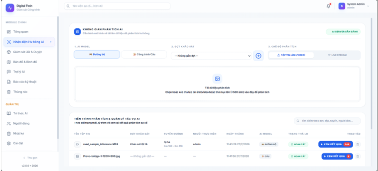
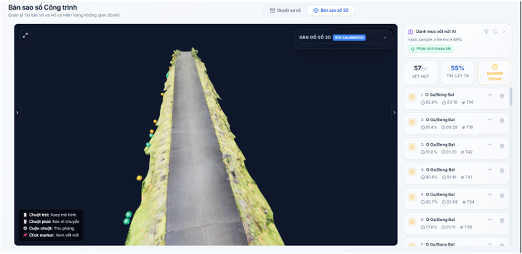
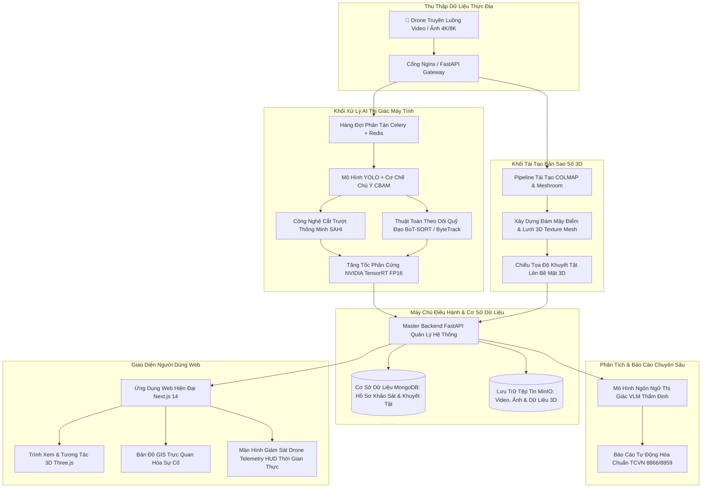

<div align="center">

# 🛸 NỀN TẢNG AI DRONE GIÁM ĐỊNH & DIGITAL TWIN 3D CÔNG TRÌNH GIAO THÔNG
### Hệ Thống Tự Động Hóa Giám Định Khuyết Tật & Quản Lý Chất Lượng Hạ Tầng Cầu Đường Bộ
**Thị Giác Máy Tính SOTA (YOLO + CBAM + SAHI) • Tái Tạo Không Gian Số 3D (Digital Twin) • Next.js 14 • FastAPI**

[](https://python.org)
[](https://pytorch.org)
[](https://developer.nvidia.com/tensorrt)
[](https://fastapi.tiangolo.com)
[](https://nextjs.org)
[](https://tailwindcss.com)
[](https://docker.com)
[](#)

---

</div>

## 📌 1. TỔNG QUAN DỰ ÁN

Hệ thống **AI Drone Giám Định & Digital Twin 3D** là giải pháp công nghệ toàn diện kết hợp giữa **Trí tuệ nhân tạo thị giác máy tính (AI Computer Vision)** và **Công nghệ bản sao số 3D (3D Digital Twin)** nhằm tự động hóa quy trình khảo sát hiện trạng, phát hiện hư hỏng và lập báo cáo thẩm định chất lượng các công trình giao thông (Mặt đường ô tô & Cầu bê tông cốt thép).

### 🎯 Giá trị thực tiễn & Hiệu quả vượt trội:
- ⚡ **Tốc độ khảo sát gấp 20 lần**: Thay thế phương pháp đo đạc thủ công bằng thiết bị bay không người lái (Drone) kết hợp xử lý song song trên GPU.
- 🔬 **Độ chính xác tới từng milimet**: Công nghệ cắt trượt thông minh (SAHI) giúp phát hiện chính xác các vết nứt siêu nhỏ (*Micro-cracks*) trên ảnh độ phân giải siêu cao (4K/8K) mà không bị mất nét.
- 🌐 **Mô hình hóa 3D thực địa**: Gắn nhãn, đo đạc kích thước và hiển thị vị trí khuyết tật trực tiếp trong không gian 3D tương tác trên nền Web.
- 📜 **Báo cáo chuẩn hóa Tiêu chuẩn Việt Nam (TCVN)**: Tự động phân cấp mức độ nghiêm trọng và xuất báo cáo thẩm định theo **TCVN 8866**, **TCVN 8859** và bộ dữ liệu **DACL10k** tích hợp mô hình ngôn ngữ thị giác VLM (*Vision Language Model*).

---

## 📸 2. GIAO DIỆN HỆ THỐNG THỰC TẾ (SYSTEM SHOWCASE)

<div align="center">

### 🖥️ Không Gian Phân Tích & Điều Phối Tác Vụ AI
*Giao diện tải tệp tin ảnh/video đơn hoặc theo đợt (>500 ảnh), chọn mô hình (Đường bộ / Cầu), giám sát tiến trình và xem kết quả tức thời.*
<br/>


<br/><br/>

### 🌐 Trình Xem Bản Sao Số 3D & Danh Mục Khuyết Tật (3D Digital Twin)
*Tái tạo không gian số 3D kết cấu công trình, gắn thẻ tọa độ khuyết tật trong không gian thực, hiển thị danh mục độ tin cậy và mức độ nghiêm trọng.*
<br/>


</div>

---

## 🏗️ 3. KIẾN TRÚC HỆ THỐNG TOÀN DIỆN



---

## ⚡ 4. ĐIỂM NHẤN CÔNG NGHỆ & ĐỘT PHÁ KỸ THUẬT

### 🛣️ 4.1. Nhận diện khuyết tật mặt đường bộ (YOLO + CBAM + OBB)
- **Oriented Bounding Box (OBB - Hộp bao có góc xoay)**: Nhận diện chính xác hướng đi của vết nứt xiên, nứt lưới (*Alligator Crack*), ổ gà (*Pothole*), khe lún và vết nứt dọc/ngang mà không bị dư thừa diện tích nền như hộp bao thẳng truyền thống.
- **Cơ chế chú ý CBAM (Convolutional Block Attention Module)**: Tập trung nhận diện các vân nứt mờ nhạt ngay cả trong điều kiện mặt đường bị bóng cây, loang lổ ẩm ướt hoặc ánh sáng gắt.

### 🌉 4.2. Phân đoạn đa khuyết tật kết cấu cầu (DACL10k + SAHI)
- Phân loại và phân đoạn chính xác hơn 7 nhóm khuyết tật cầu bê tông: *Vết nứt kết cấu, Vôi hóa / rò rỉ chất kết dính, Lộ cốt thép, Bong tróc bê tông, Rỉ sét ăn mòn, Ẩm ướt thấm nước*.
- **SAHI (Slicing Aided Hyper Inference)**: Tự động chia nhỏ ảnh 4K/8K thành các ô tile 640x640 có độ gối chồng (*overlap*), sau đó hợp nhất qua thuật toán NMM (*Non-Maximum Merging*), đảm bảo không bỏ sót bất kỳ vết nứt siêu nhỏ nào.

### 🎯 4.3. Theo dõi hành trình & Khử trùng lặp (BoT-SORT + GMC)
- Sử dụng thuật toán theo dõi **BoT-SORT** kết hợp bù trừ chuyển động camera drone **GMC (Global Motion Compensation)** để duy trì ID duy nhất cho từng khuyết tật trên suốt hành trình bay.
- **Khử trùng lặp đa khung hình**: Tránh tính toán trùng lặp diện tích và số lượng hư hỏng khi drone bay qua lại.

### ⚡ 4.4. Tăng tốc suy luận GPU (NVIDIA TensorRT)
- Chuyển đổi và tối ưu mô hình sang định dạng **TensorRT Engine (FP16 / INT8)**, đạt tốc độ xử lý dưới **30 mili-giây / khung hình**, đáp ứng hoàn hảo yêu cầu truyền hình ảnh trực tiếp.

### 🌐 4.5. Bản sao số 3D Digital Twin tương tác
- Tích hợp **COLMAP & Meshroom** xây dựng mô hình kết cấu 3D dạng textured mesh (`.obj`, `.gltf`).
- Người dùng có thể xoay 360°, phóng to từng góc khuất của dầm cầu, đo đạc trực tiếp chiều dài/diện tích vết nứt và xem vết nứt trên mô hình 3D thực.

---

## 💻 5. DANH MỤC CÔNG NGHỆ SỬ DỤNG (TECH STACK)

| Khối Chức Năng | Công Nghệ & Thư Viện Chính |
| :--- | :--- |
| **AI & Thị Giác Máy Tính** | PyTorch, Ultralytics YOLO, SAHI, OpenCV, Supervision, Albumentations |
| **Tối Ưu & Tăng Tốc GPU** | NVIDIA TensorRT, CUDA 12.x, ONNX Runtime GPU |
| **Hàng Đợi & Xử Lý Chạy Ngầm** | Celery Distributed Worker, Redis Cache & Broker |
| **Master Backend Quản Lý** | FastAPI, Pydantic v2, Motor (Async MongoDB), SQLAlchemy, JWT Auth |
| **Frontend Giao Diện Web** | Next.js 14 (App Router), React 18, TypeScript, Tailwind CSS, Lucide Icons |
| **Đồ Họa 3D & Bản Đồ GIS** | Three.js, React Three Fiber, Leaflet GIS Mapping |
| **Hạ Tầng & Triển Khai (DevOps)**| Docker, Docker Compose, Nginx Reverse Proxy |

---

## 📁 6. CẤU TRÚC THƯ MỤC DỰ ÁN (MONOREPO)

```
crack-digitaltwin-platform/
├── api/                            # Khối Dịch Vụ AI & Phân Tích Dữ Liệu
│   ├── crack_api/                  # Core AI Engine (YOLO, SAHI, Tracking, Celery Worker)
│   │   ├── celery_tasks.py         # Tiến trình Celery xử lý ảnh đơn, lô ảnh và video offline
│   │   ├── inference_engine.py     # Bộ suy luận SOTA tích hợp SAHI + TensorRT
│   │   ├── cbam_module.py          # Module chú ý không gian và kênh CBAM
│   │   ├── main.py                 # REST API FastAPI lắng nghe yêu cầu giám định
│   │   └── Dockerfile              # Cấu hình container Docker AI chuyên dụng GPU
│   ├── meshroom_3d/                # Dịch vụ tái tạo mô hình 3D (Meshroom / COLMAP)
│   └── chatbot_middleware/         # Middleware kết nối Chatbot tư vấn tiêu chuẩn TCVN
│
├── web/                            # Khối Giao Diện & Điều Hành Web
│   ├── frontend/                   # Ứng dụng Next.js 14
│   │   ├── src/app/crack-detection # Giao diện giám định ảnh/video & HUD Drone
│   │   ├── src/app/digital-twin    # Trình tương tác mô hình 3D Three.js
│   │   ├── src/app/incidents-map   # Bản đồ GIS theo dõi điểm hư hỏng trên tuyến
│   │   └── src/components/         # Thư viện component giao diện dùng chung
│   ├── backend/                    # FastAPI Master Backend (Quản lý đợt khảo sát, thẩm định, phân quyền)
│   └── nginx/                      # Cấu hình máy chủ điều hướng Nginx
│
├── docs/images/                    # Ảnh chụp giao diện thực tế của hệ thống
├── docker-compose.yml              # File điều phối toàn bộ hệ thống bằng Docker Compose
├── .env.example                    # Mẫu cấu hình biến môi trường an toàn
└── .gitignore                      # Quy tắc loại trừ tệp tin rác và bảo mật
```

---

## 🚀 7. HƯỚNG DẪN CÀI ĐẶT & CHẠY HỆ THỐNG

### 1. Tải Mã Nguồn Về Máy
```bash
git clone https://github.com/buivanhoa04/crack-detection-digitaltwin-platform.git
cd crack-detection-digitaltwin-platform
```

### 2. Thiết Lập Biến Môi Trường
```bash
# Tạo file cấu hình môi trường từ mẫu
cp .env.example .env

# Chỉnh sửa file .env để cấu hình cổng mạng và API Key (nếu có)
```

### 3. Khởi Chạy Toàn Bộ Hệ Thống Với Docker Compose
```bash
# Khởi động toàn bộ Web, Backend, AI Engine, MongoDB và Redis
docker compose up -d --build
```

### 4. Truy Cập Sử Dụng
- 🌐 **Giao diện Web Người Dùng**: `http://localhost:3000`
- 📡 **Tài liệu API Backend Quản Lý**: `http://localhost:8000/docs`
- 🤖 **Tài liệu API Dịch Vụ AI**: `http://localhost:8000/api/v1/docs`

---

## 👨‍💻 8. THÔNG TIN TÁC GIẢ & LIÊN HỆ
- **Kỹ sư phát triển**: **Bùi Văn Hòa** ([@buivanhoa04](https://github.com/buivanhoa04))
- **Email liên hệ**: `buivanhoa04@gmail.com`
- **Lĩnh vực chuyên môn**: Kỹ sư Thị giác Máy tính (Computer Vision) • Chuyên gia AI & Digital Twin Hạ tầng Giao thông
